# 🐾 PawPal - Pet Management Platform

## Project Description

PawPal is a comprehensive web application designed for pet owners and animal lovers, providing a one-stop solution for all pet-related needs. The platform enables users to adopt pets, manage pet accounts, book veterinary appointments, report lost or found pets, read and share pet care tips, upload photos, and shop for pet essentials—all in one centralized location.

The application supports two user roles: **Customers** (regular pet owners) and **Admins** (system managers), each with tailored functionalities to ensure smooth platform operation and an excellent user experience.

## 🖼️ Screenshots

### Homepage & Authentication
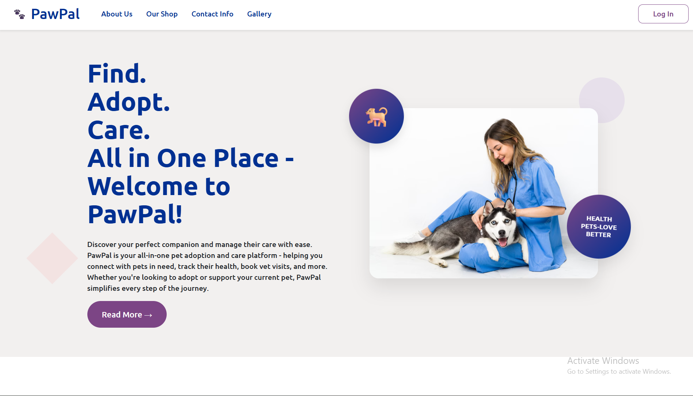
*Clean and welcoming homepage with easy navigation*

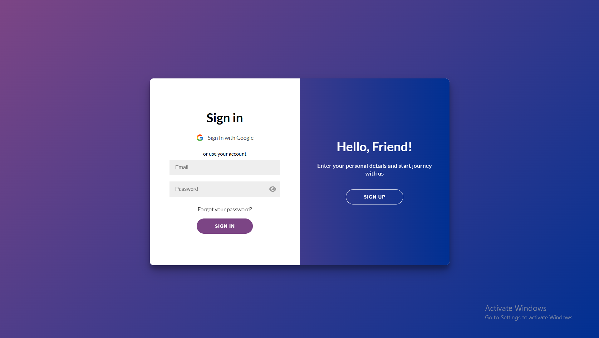
*Secure login system with password recovery option*

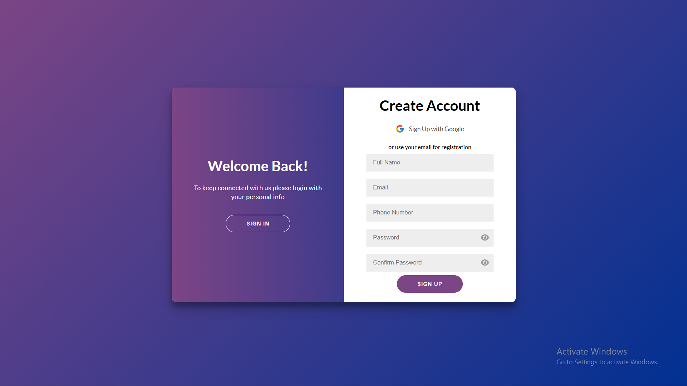
*Simple registration process for new users*

### Customer Dashboard
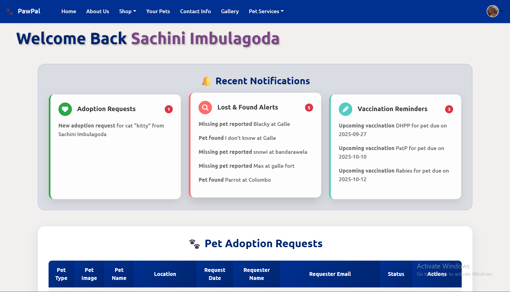
*Personalized dashboard with notifications and adoption requests*

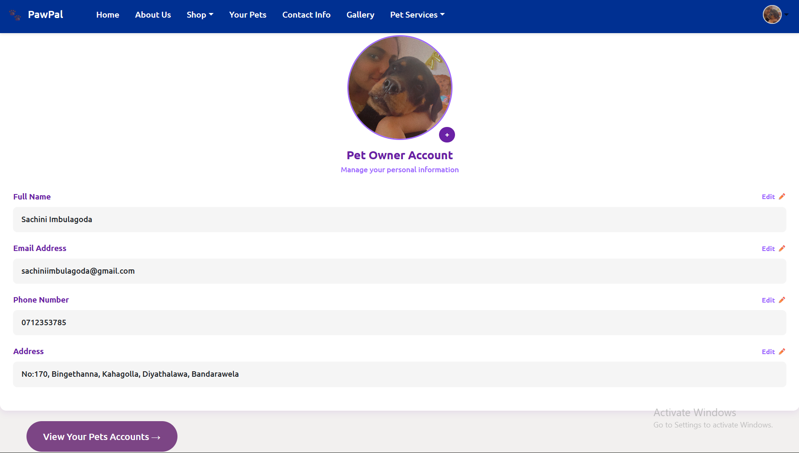
*User profile management with photo upload capability*

### Pet Management
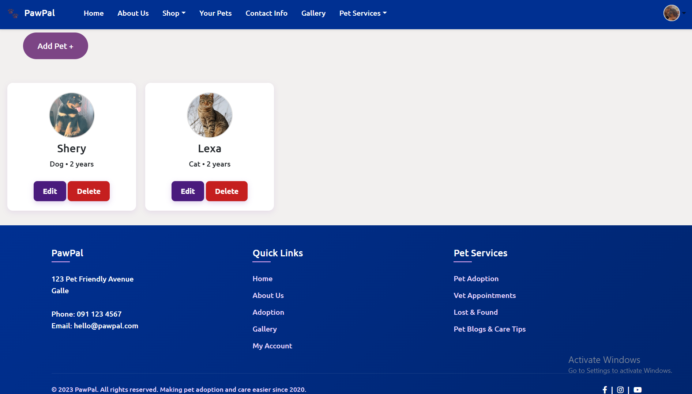
*Individual pet profiles with health records and vaccination tracking*

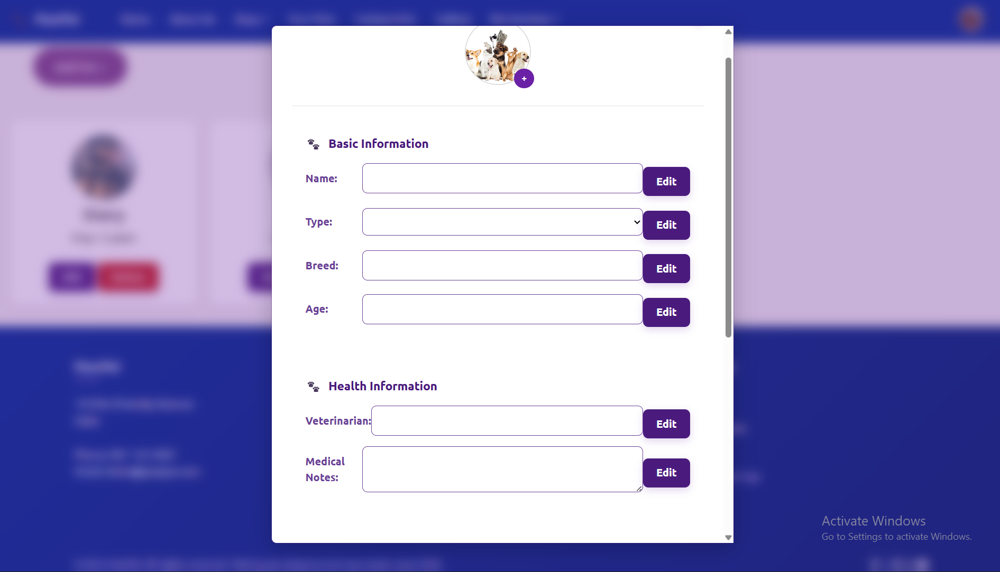
*Easy pet registration form with photo upload*

### Pet Adoption
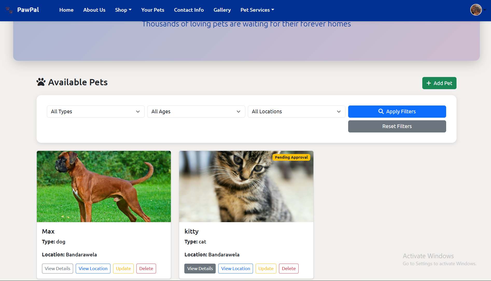
*Browse available pets with filtering options*

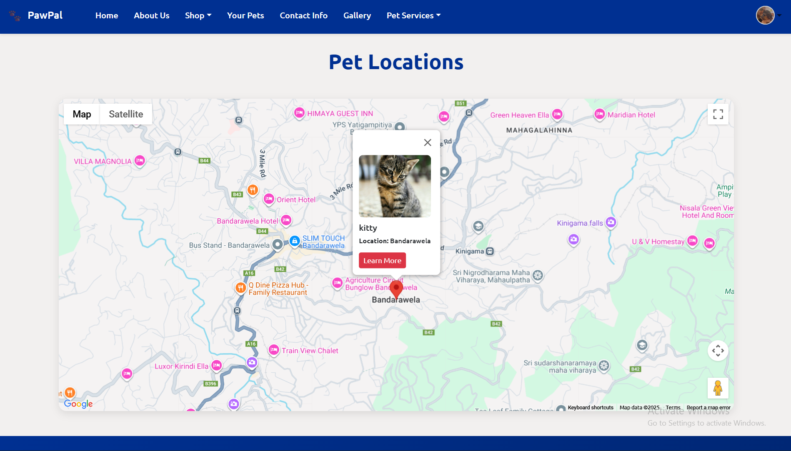
*Detailed pet information with location mapping*

### Veterinary Services
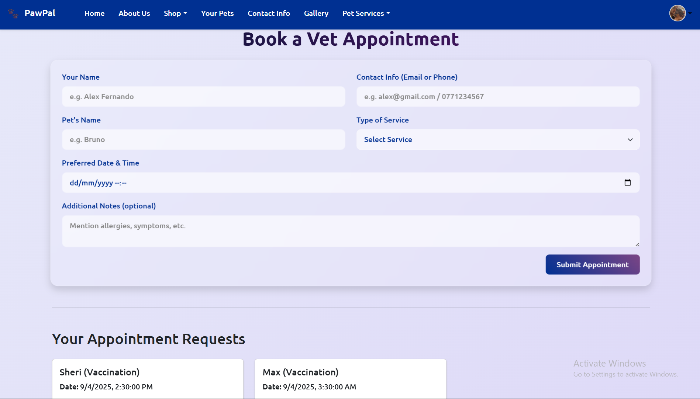
*Simple appointment booking system with management options*

### Lost & Found
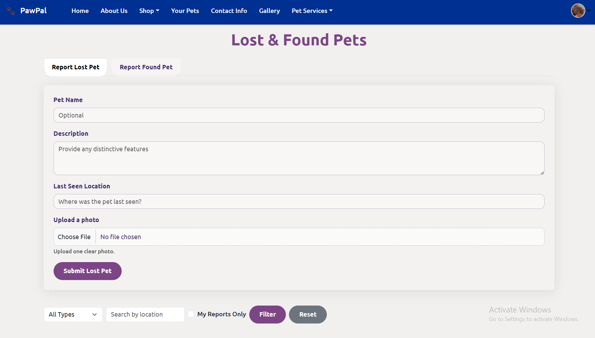
*Community-driven lost and found pet reporting system*

### Pet Gallery
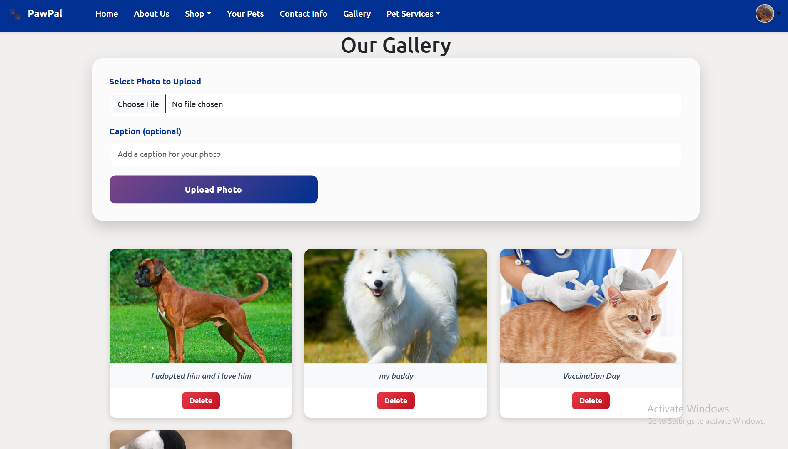
*Share and view adorable pet photos with descriptions*

### Blogs & Care Tips
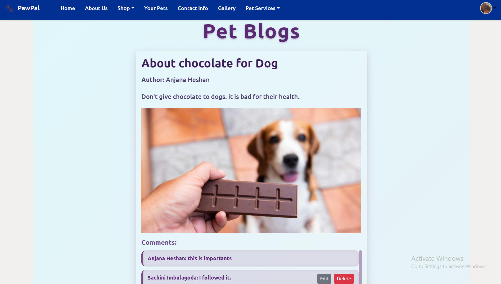
*Educational content with commenting functionality*

### Pet Shop
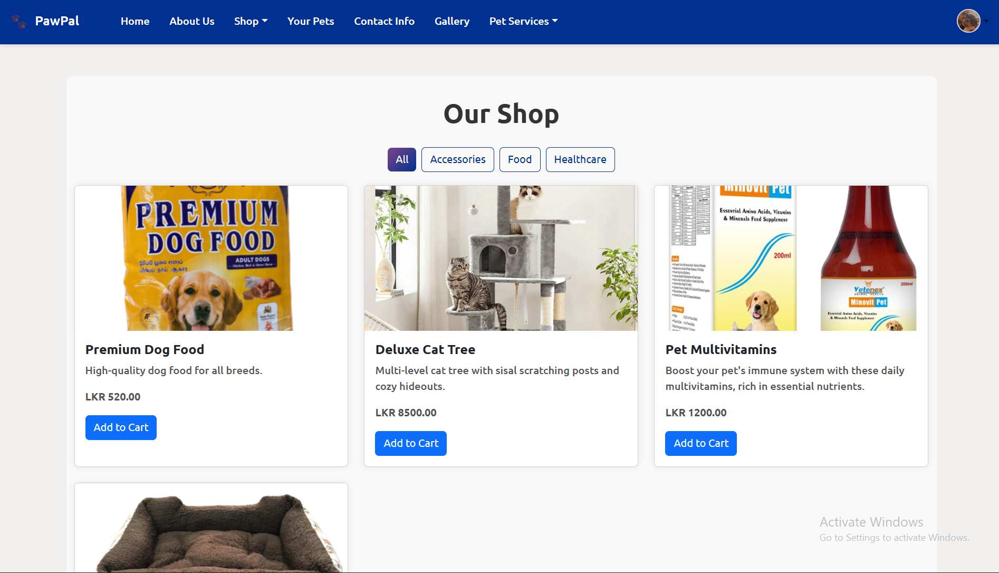
*Complete e-commerce solution for pet supplies*

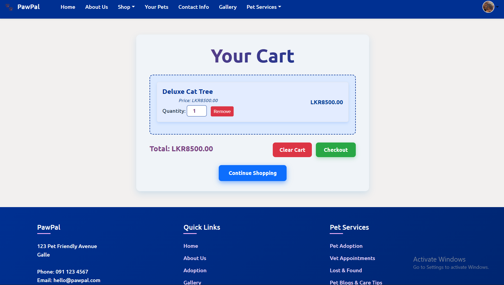
*User-friendly cart management and checkout process*

### Admin Dashboard
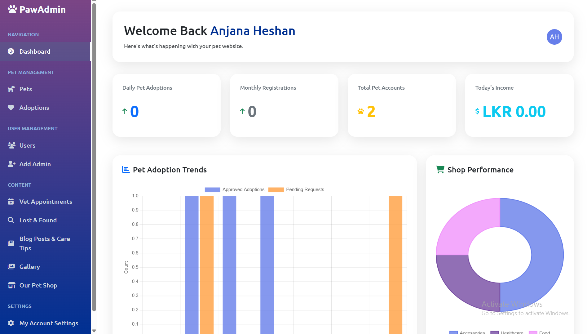
*Comprehensive admin control panel*

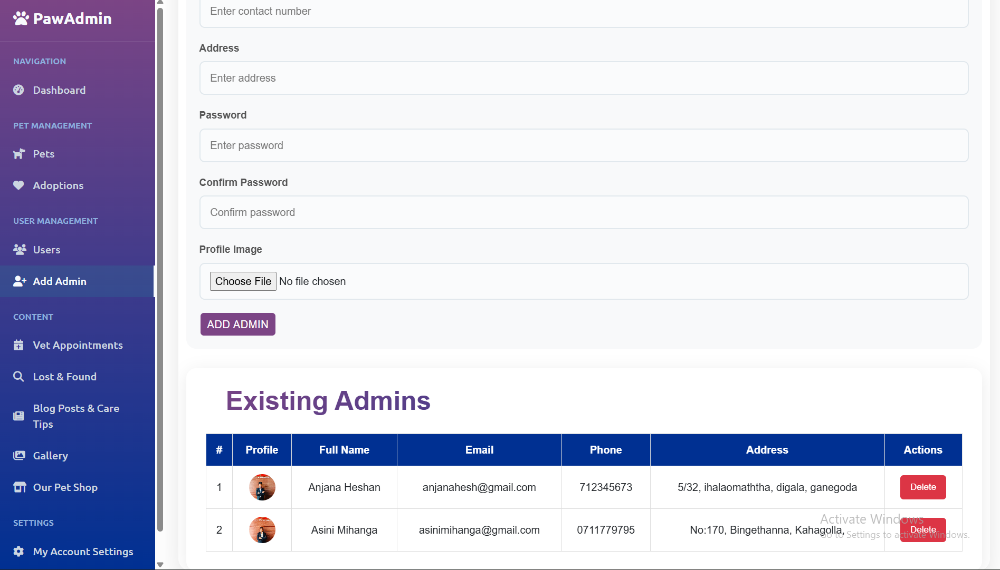
*Complete user management system*

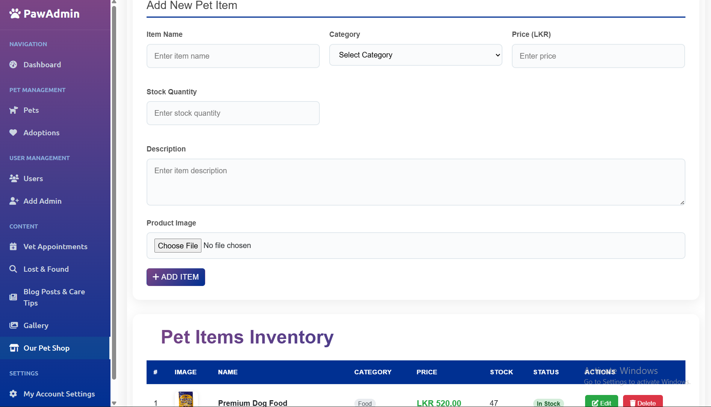
*Product catalog management with full CRUD operations*

## 🛠️ Technologies Used

### Backend
- **Java Spring Boot** - Main framework
- **Spring Security** - Authentication and authorization
- **JWT (JSON Web Tokens)** - Secure token-based authentication
- **Spring Data JPA** - Database operations
- **MySQL** - Primary database
- **Cloudinary** - Image upload and management
- **WebSocket** - Real-time communication
- **Maven** - Dependency management

### Frontend
- **HTML5** - Markup structure
- **CSS3** - Styling and responsive design
- **JavaScript** - Dynamic functionality
- **Bootstrap** - UI framework (if used)
- **Google Maps API** - Location services

## 📁 Project Structure

```
PawPal/
├── frontend/
│   ├── index.html
│   ├── css/
│   ├── js/
│   ├── images/
│   └── pages/
└── backend/
    ├── src/
    │   ├── main/
    │   │   ├── java/
    │   │   │   └── com/pawpal/
    │   │   │       ├── config/
    │   │   │       ├── controller/
    │   │   │       ├── dto/
    │   │   │       ├── entity/
    │   │   │       ├── exception/
    │   │   │       ├── repository/
    │   │   │       ├── service/
    │   │   │       └── util/
    │   │   └── resources/
    │   │       └── application.properties
    │   └── test/
    ├── pom.xml
    └── README.md
```

## ⚙️ Setup Instructions

### Prerequisites
- Java 17 or higher
- Maven 3.6+
- MySQL 8.0+
- Node.js (for frontend development tools, if any)
- Git

### Backend Setup

1. **Clone the repository**
   ```bash
   git clone https://github.com/sachi-thakshi/PawPal.git
   cd pawpal/backend
   ```

2. **Configure Database**
   - Create a MySQL database named `pawpal`
   ```sql
   CREATE DATABASE pawpal;
   ```

3. **Update Application Properties**
   ```properties
   # Database Configuration
   spring.datasource.url=jdbc:mysql://localhost:3306/pawpal
   spring.datasource.username=your_username
   spring.datasource.password=your_password
   spring.datasource.driver-class-name=com.mysql.cj.jdbc.Driver

   # JPA Configuration
   spring.jpa.hibernate.ddl-auto=update
   spring.jpa.show-sql=true
   spring.jpa.properties.hibernate.dialect=org.hibernate.dialect.MySQL8Dialect

   # JWT Configuration
   jwt.secret=your_jwt_secret_key
   jwt.expiration=86400000

   # Cloudinary Configuration
   cloudinary.cloud-name=your_cloud_name
   cloudinary.api-key=your_api_key
   cloudinary.api-secret=your_api_secret

   # Email Configuration (for password reset)
   spring.mail.host=smtp.gmail.com
   spring.mail.port=587
   spring.mail.username=your_email@gmail.com
   spring.mail.password=your_app_password
   ```

4. **Install Dependencies and Run**
   ```bash
   mvn clean install
   mvn spring-boot:run
   ```

   The backend server will start on `http://localhost:8080`

### Frontend Setup

1. **Navigate to Frontend Directory**
   ```bash
   cd ../frontend
   ```

2. **Configure API Base URL**
   - Update the API base URL in your JavaScript files to point to your backend server
   ```javascript
   const API_BASE_URL = 'http://localhost:8080';
   ```

3. **Set up Google Maps API (if required)**
   - Obtain a Google Maps API key
   - Add it to your HTML files:
   ```html
   <script src="https://maps.googleapis.com/maps/api/js?key=YOUR_API_KEY"></script>
   ```

4. **Serve the Frontend**
   - Place your frontend files (HTML, CSS, JS) in the Spring Boot `Front_end` directory
   - Alternatively, if keeping frontend separate:
   ```bash
   # Navigate to frontend directory
   cd frontend
   
   # Open index.html directly in browser, or
   # Use Live Server extension in VS Code for development
   ```

   The frontend will be served by Spring Boot at `http://localhost:8080` or run separately for development


### Default Admin Account
- **Email**: admin@pawpal.com
- **Password**: admin123

## 🌟 Key Features

### For Pet Owners (Customers)
- **Account Management**: Profile creation and management with photo upload
- **Pet Profiles**: Individual accounts for each pet with health records
- **Pet Adoption**: Browse, filter, and apply to adopt pets
- **Veterinary Services**: Book and manage vet appointments
- **Lost & Found**: Report and search for lost/found pets
- **Photo Gallery**: Share pet photos with the community
- **Pet Shopping**: Purchase pet supplies with secure checkout
- **Educational Content**: Read blogs and care tips

### For Administrators
- **User Management**: View and manage all registered users
- **Pet Oversight**: Monitor all pets and adoption requests
- **Content Management**: Create and manage blog posts
- **Shop Management**: Add, edit, and remove products
- **System Monitoring**: Track appointments and lost/found reports
- **Admin Creation**: Add new administrators to the system

## 🔐 Security Features

- **JWT Authentication**: Secure token-based login system
- **Role-based Access Control**: Different permissions for customers and admins
- **Password Security**: Encrypted password storage
- **Email Verification**: OTP-based password recovery
- **Input Validation**: Comprehensive data validation on both frontend and backend

## 📧 Email Integration

The platform includes email functionality for:
- Password reset OTP delivery
- Order confirmations and invoices
- Adoption request notifications
- Appointment confirmations

## 🎥 Demo Video

Watch the complete project demonstration here:
**[Spring Boot Project - IJSE - GDSE72 - Galle - I.D.Sachini Thakshila - 2nd Semester Final Project](https://youtu.be/F-SnIFhq1Xk?si=6g9VEcrvGWRg9ZyQ)**

## 🤝 Contributing

1. Fork the repository
2. Create your feature branch (`git checkout -b feature/AmazingFeature`)
3. Commit your changes (`git commit -m 'Add some AmazingFeature'`)
4. Push to the branch (`git push origin feature/AmazingFeature`)
5. Open a Pull Request

## 📝 License

This project is licensed under the MIT License - see the [LICENSE.md](LICENSE.md) file for details.

## 👨‍💻 Developer

**[Your Name]**
- Email: sachiniimbulagoda@gmail.com
- LinkedIn: [https://www.linkedin.com/in/sachini-imbulagoda-6a767b311?utm_source=share&utm_campaign=share_via&utm_content=profile&utm_medium=ios_app]
- GitHub: [@sachi-thakshi](https://github.com/sachi-thakshi)

## 🙏 Acknowledgments

- IJSE (Institute of Java Software Engineering)
- GDSE Program instructors and mentors
- The pet-loving community that inspired this project

---

## 📞 Support

For any questions or support, please contact:
- Email: sachiniimbulagoda@gmail.com
- Create an issue in this repository

**Made with ❤️ for pets and their humans 🐾**
